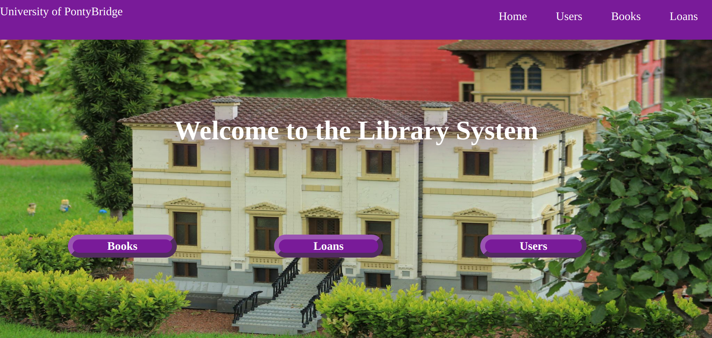
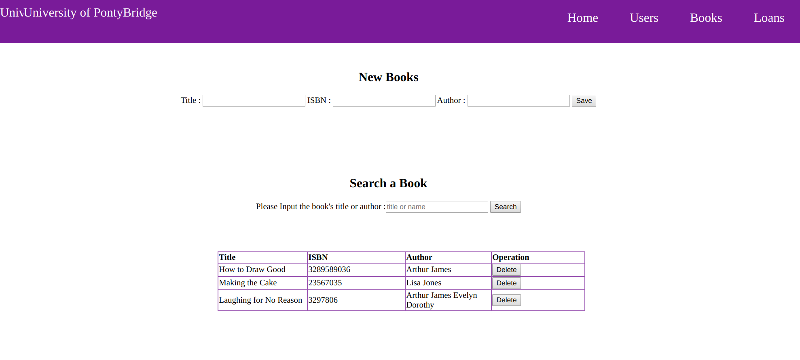
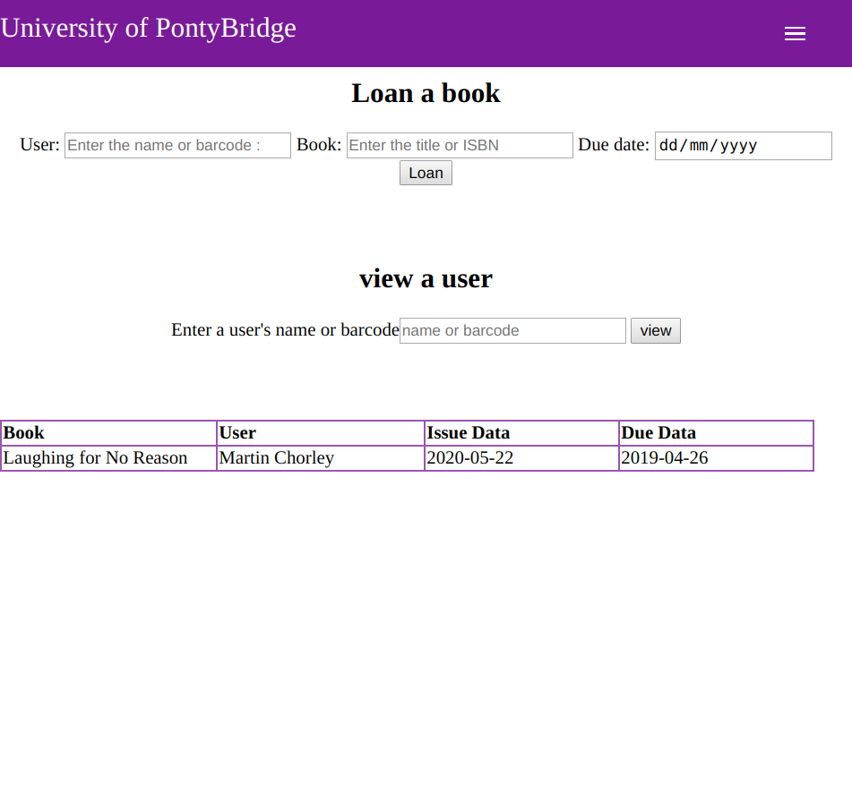
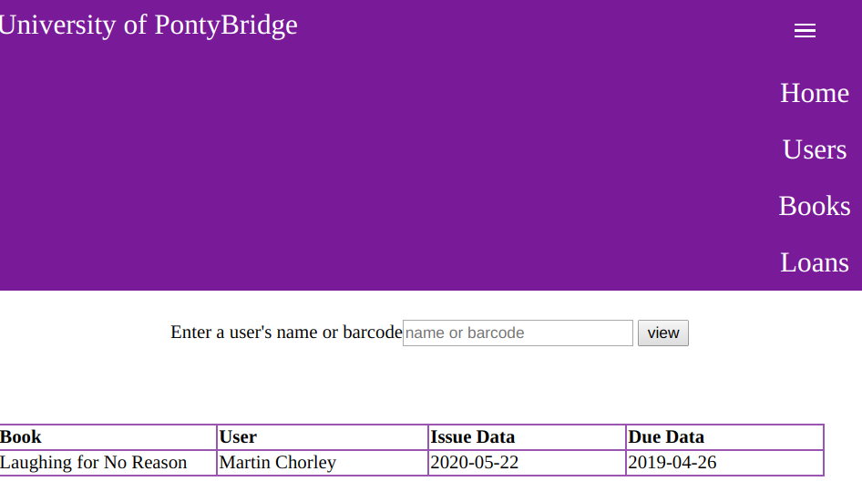

#Library Management Sysyem

## Installation

Download and install all requirements for the server with:

```
npm install
```

## Initialising a Database

Before you run the server for the first time, you should ensure there is a database available for it to read and write to. You can initialise the database with:

```
node initialise_database.js
```
## Running the Server

```
node server.js
```

## Opening Index.html
### Pc: index books interface




### Phone: loan book



